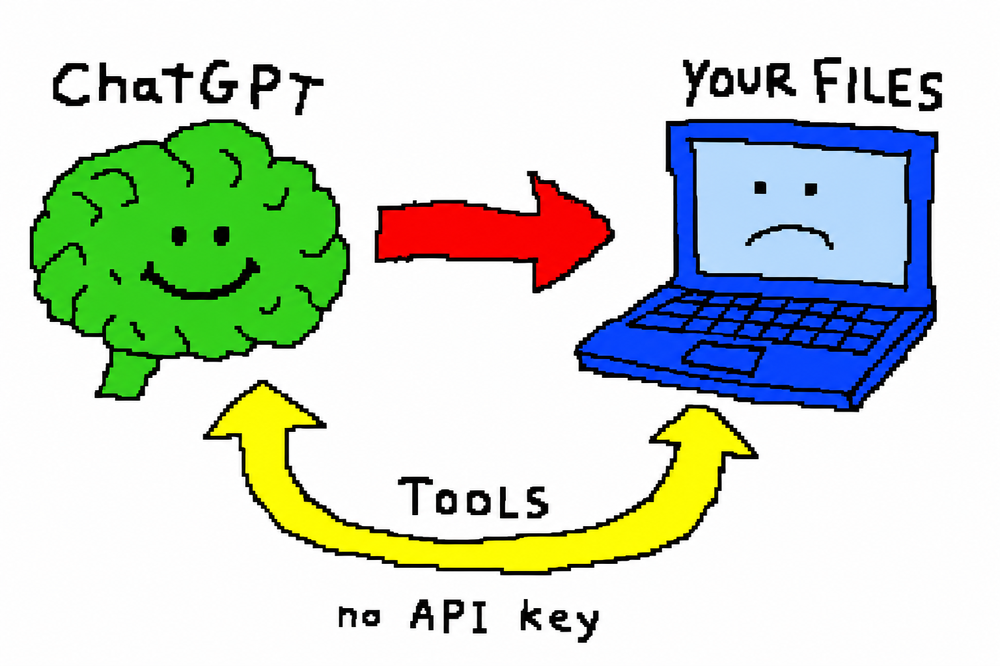
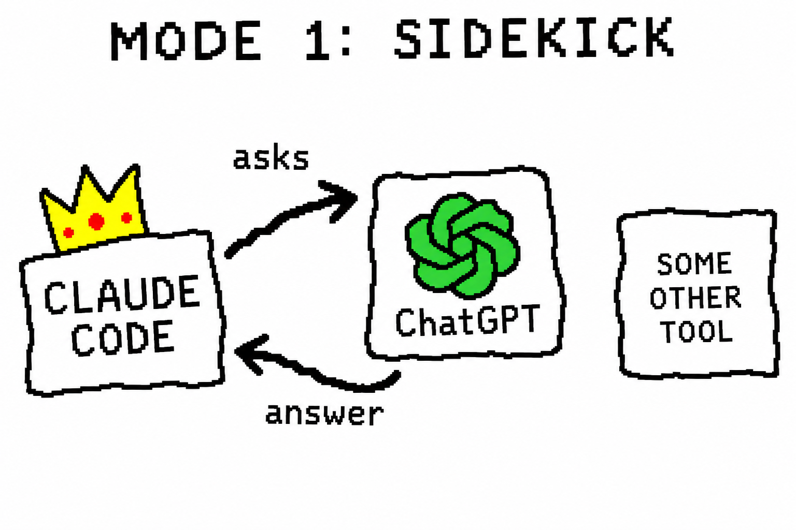
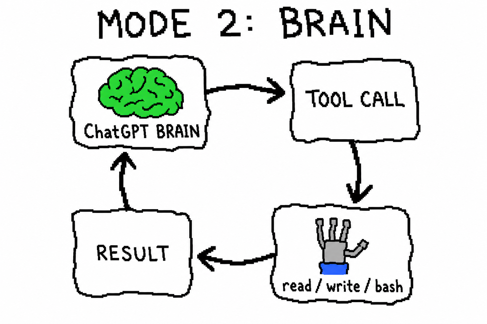
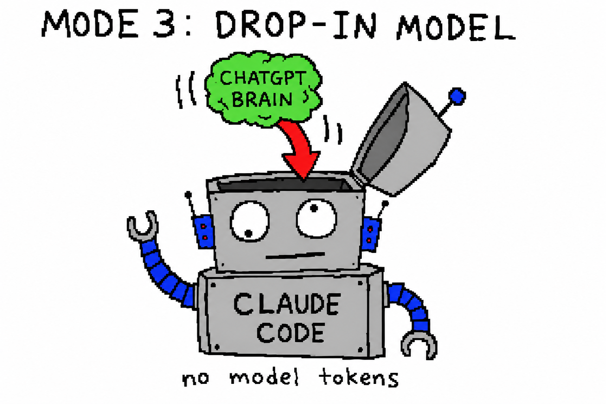
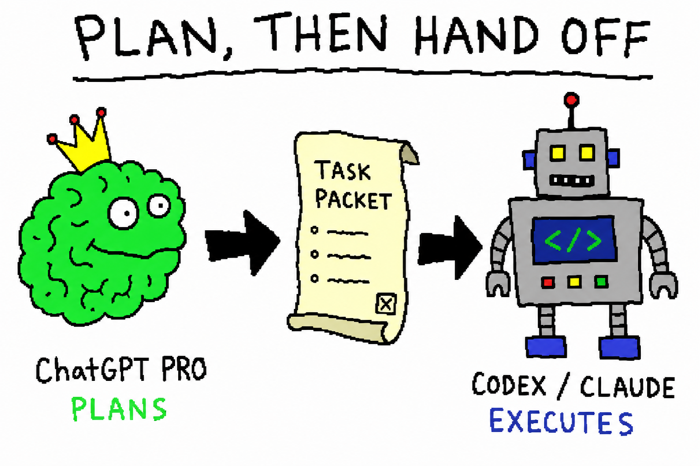
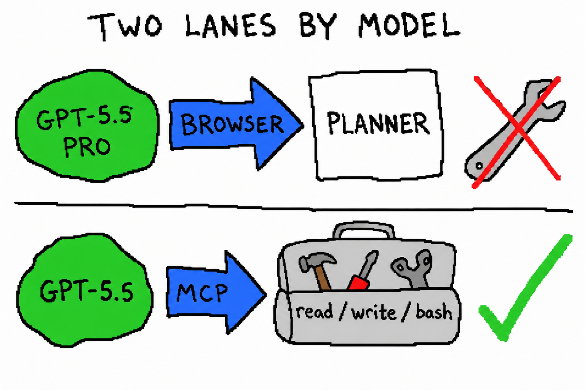

# chatgpt-use

> Turn your **ChatGPT web subscription** into a coding-agent backend — **no API key, no Codex billing.**
> Built on [`chrome-use`](https://github.com/leeguooooo/chrome-use), same lineage as [`chatgpt-imagegen`](https://github.com/leeguooooo/chatgpt-imagegen) and [`cookie-use`](https://github.com/leeguooooo/cookie-use).

<p align="center"><em>🚧 Experimental · design phase. The architecture below is the contract; the binary is being built against it.</em></p>



Your Plus / Pro plan already includes a chat surface you've paid for. `chatgpt-use` drives that
**logged-in web conversation** through `chrome-use` — exactly the way `chatgpt-imagegen` drives image
generation — and wires it into your local machine. The result: a coding agent (Claude Code, Codex,
anything) can hand work to ChatGPT, and ChatGPT can read and edit your project files.

The web chat surface is **not the API** and **not the Codex-usage bucket**. So the work runs on quota
you've *already bought* — that's the whole point.

---

## Why this exists

| | API / `codex exec` | **chatgpt-use (web)** |
|---|---|---|
| Auth | `OPENAI_API_KEY` or Codex login | your normal browser login |
| Billing | per-token API spend / Codex-usage limit | **your flat monthly subscription** |
| File access | you build context plumbing | **`read_file` tool — no tunnel** |
| Setup | keys, env, gateways | `chrome-use` + a logged-in tab |

If you're already paying for ChatGPT Plus/Pro and *also* burning API credits or Codex-usage limits
from your coding agent, this closes the gap: route the cheap-and-already-paid work to the browser.

---

## Three modes

`chatgpt-use` is one engine — a `chrome-use`-driven **channel** to the ChatGPT web conversation (send a
message, wait for the reply, parse it) — exposed three ways depending on **who's the brain**.

### Mode 1 · 副手 / Sidekick — `chatgpt-use ask`



**Your harness stays the brain.** Claude Code / Codex keeps planning and calling its own tools, and
delegates a single sub-task — reasoning, code generation, a review pass — to ChatGPT when it wants a
second brain. One round trip, no tool loop.

```bash
# one-shot: pipe context in, get an answer back
chatgpt-use ask "Review this diff for race conditions" --file src/server.rs

# or feed it whatever you already gathered
git diff | chatgpt-use ask "Explain what changed and what might break"
```

- The **caller** decides what context to send — `chatgpt-use` just relays it and returns ChatGPT's text.
- ChatGPT does **not** touch your machine in this mode.
- Borrows the web-driving practices proven in
  [`chatgpt-imagegen`](https://github.com/leeguooooo/chatgpt-imagegen): profile auto-detection
  (`relay` → logged-in profile), composer polling, rate-limit-dialog detection, in-page
  authenticated `fetch`, and conversation filing under a ChatGPT **Project**.

### Mode 2 · 大脑 / Brain — `chatgpt-use run`



**ChatGPT is the brain; your machine is the hands.** A local agent loop — the same shape as Codex or
Claude Code — but the model is your web subscription:

1. `chatgpt-use` seeds the conversation with a **system prompt that defines a tool protocol**.
2. ChatGPT replies with a structured **tool call** (a fenced JSON block — see the caveat below).
3. The local harness **executes that tool** (`read_file`, `write_file`, `bash`, `grep`, `list_dir`, …)
   and feeds the observation back into the chat.
4. Loop until ChatGPT declares the task done.

```bash
chatgpt-use run "Add a --json flag to the status command and update the tests"
```

**This is why goal "let ChatGPT read my files" needs no tunnel and no exposed file server.** File
access *is* the `read_file` / `grep` tools: the local harness reads the bytes and hands them into the
conversation. ChatGPT never reaches back to your machine — it just asks, and the hands obey.

### Mode 3 · 替身 / Drop-in model — `chatgpt-use serve`



**Claude Code stays exactly as it is — its agent loop, its tools, its UX — but the model behind it is
secretly ChatGPT.** `chatgpt-use serve` exposes a local **Anthropic-compatible endpoint**
(`/v1/messages`, streaming). Point Claude Code at it:

```bash
chatgpt-use serve --port 8787 &
ANTHROPIC_BASE_URL=http://127.0.0.1:8787 ANTHROPIC_AUTH_TOKEN=whatever claude
```

Now every model call Claude Code makes — the thing that *spends Anthropic model tokens* — is
intercepted, translated into a prompt, driven through your ChatGPT web subscription, and translated
back into Anthropic's response shape (**including `tool_use` blocks**, so Claude Code's own tools keep
working). Claude Code never knows its brain was swapped.

- **No model tokens.** Claude Code's loop runs locally and free; the tokens it would have billed are
  served by your flat subscription instead.
- Reuses Mode 2's **text tool-call protocol + parser** — but instead of running our own loop, it
  re-encodes ChatGPT's tool calls as Anthropic `tool_use` blocks and hands them back to Claude Code,
  which runs its own tools.
- The most ambitious and most fragile mode (see caveats): Claude Code's prompts are large, tool-call
  fidelity over a text protocol is imperfect, and the web surface rate-limits. **Experimental².**

All three modes share one engine: **Mode 1** is Mode 2 with tools off; **Mode 3** is Mode 2's tool
protocol re-dressed as an Anthropic API so an *existing* harness can wear ChatGPT as its model.

---

## How it works

```
  ┌─────────────────────────────────────────────────────────────────┐
  │  chatgpt-use  (Rust CLI)                                         │
  │                                                                  │
  │   task ─▶ system prompt + tool protocol                          │
  │              │                                                   │
  │              ▼                                                   │
  │      ┌───────────────┐   eval/send/poll   ┌──────────────────┐   │
  │      │  agent loop   │ ─────────────────▶ │  chrome-use      │   │
  │      │  + tool exec  │ ◀───────────────── │  (logged-in tab) │   │
  │      └───────────────┘   parsed reply     └────────┬─────────┘   │
  │              │                                     │             │
  │     read_file/write_file/bash/grep         ChatGPT web chat      │
  │              ▼                              (your subscription)  │
  │        your project files                                       │
  └─────────────────────────────────────────────────────────────────┘
```

Everything page-side goes through `chrome-use eval <js>` (run JS in the page, get JSON back). Sending
a prompt = fill `#prompt-textarea` + click send. "Reply done" = poll until the stop/streaming control
disappears, watching for the *"Too many requests"* dialog. All proven in `chatgpt-imagegen`.

---

## Target architecture: dual-channel by model tier

Live testing + studying three mature projects (see below) converged on one design rule:
**don't make web ChatGPT role-play tools — route by what each model tier can actually do.**
Full write-up: [`docs/architecture.html`](docs/architecture.html).



```
                         chatgpt-use (local daemon)
                                    │
        ┌───────────────────────────┼────────────────────────────┐
        │                           │                            │
   browser channel             MCP channel                  executor
   (chrome-use)                (local server +              handoff
        │                       public tunnel)                   │
        ▼                           ▼                            ▼
  GPT-5.5 **Pro**            GPT-5.5 Instant/Thinking     Codex / Claude Code
  planner / reviewer         native tool-calling          run the plan locally
  (NO Apps/MCP on Pro →      (real MCP tools, no
   browser is the only       role-play wall)
   way to reach Pro)
```



- **Pro can't use Apps/MCP** (confirmed: OpenAI Help Center — *"Apps … are not available with Pro"*).
  So Pro is reachable **only** through the browser channel, and is best used as a **planner/reviewer**
  that returns a **structured delegation packet**, not as an autonomous file-editor.
- **Regular GPT-5.5** *can* call native MCP tools — so genuine tool autonomy belongs on an **MCP
  channel** (a local server exposed via a public tunnel, since ChatGPT runs in the cloud and can't
  reach `localhost`), not on a faked browser text-protocol.
- **Execution stays local.** The planner emits a typed packet
  (`{goal, plan[], risks, tests, acceptance, do_not_do, verdict: proceed|revise|blocked}`); the
  executor (Codex / Claude Code) only consumes packets — web ChatGPT never edits files directly.
- **The value is rate-limit arbitrage:** your ChatGPT subscription quota is separate from the
  Codex/API bucket, so a Pro plan's planning power becomes "free" executor-adjacent capacity.

This is the **target**; the three modes below are the building blocks we're growing toward it.

## Prior art we're borrowing from

| Project | What we take |
|---|---|
| [`ChesterRa/cccc`](https://github.com/ChesterRa/cccc) (930★) | dual-transport (browser **push** + MCP **pull**); append-only `ledger.jsonl` + single-writer daemon + stateless frontends; actor-bound token (hash-stored); `bootstrap` recovery packet. Also the source of the hard "Pro can't use MCP connectors" finding. |
| [`tt-a1i/hive`](https://github.com/tt-a1i/hive) (369★) | `<xml-system-reminder>` anchor tags placed at message **tail** (survive `/compact`); `PROTOCOL.md` fallback anchor; `tasks.md` task graph; session-resume by reading CLI rollout files. |
| [`RPG-478/codex-chatgpt-bridge`](https://github.com/RPG-478/codex-chatgpt-bridge) | the planner-executor split done right: **delegation-packet** prompts (sender = a machine, not a human), **mode-typed** (`plan`/`review`/`debug`/`research`), strict `verdict: proceed\|revise\|blocked` schema with **fail-fast** parsing; same stable-reply detection we already use. |

---

## The honest caveats

This is a clever hack on a surface that was never meant to be an API. We're upfront about it:

- **No native function-calling on the browser surface.** The web chat has no tool-call API (that's
  API-only). We tried a **text protocol** in the system prompt — and live testing across **three**
  framings (*"you have tools"*, *"you have no access"*, *"you're a protocol generator + machine
  delegation + few-shot"*) **all got refused**: a strongly-grounded web model insists *"pasting tool
  schema text doesn't make those tools real — paste the file."* Conclusion (matching all three prior-art
  projects): **don't fight it.** Native tool-calling belongs on the **MCP channel** (regular GPT-5.5),
  and the **browser channel** should use ChatGPT as a **planner/reviewer** returning structured packets,
  not as an autonomous tool-runner. Mode 1 (no tools) works today; the autonomous browser loop (Mode 2)
  stays an open research track, not the main path.
- **Pro is browser-only.** GPT-5.5 **Pro** — the strongest planner — cannot use Apps/MCP, so it's
  reachable only through the browser channel. (Also: selecting Pro in the new ChatGPT UI isn't yet
  automatable here — a `--model` flag is on the roadmap; today the channel uses the account default.)
- **Rate limits are real.** Driving the one shared logged-in tab, the page rate-limits aggressively, so
  the channel runs at **concurrency 1** and queues across processes (flock), same as `chatgpt-imagegen`.
- **It's slower than the API.** You're waiting on a browser rendering a chat. Fine for offloading;
  not for tight latency loops.
- **Mode 3 is the deep end.** A full chat harness's traffic squeezed through a browser chat box: slow,
  occasionally wrong, and only as good as the tool-call translation. It's a proof-of-concept of "free
  Claude Code", not a daily driver — yet.
- **ToS — read this.** OpenAI's Terms prohibit programmatically extracting Output and bypassing rate
  limits. So the honest positioning is **not** "web ChatGPT as a free API." It's: *"use your own
  logged-in ChatGPT (esp. Pro) as a high-quality planner/reviewer in a local coding workflow; execution
  stays with Codex / Claude Code / local tools."* Stay within your plan's terms; this is a personal
  productivity bridge, not a resale/automation-at-scale tool.
- **macOS first** (matches `chrome-use` / `cookie-use`); other platforms follow `chrome-use`.

---

## Install

> Distribution follows the GitHub-Release route (no npm, no token). Once the first binary ships:

```bash
curl -fsSL https://raw.githubusercontent.com/leeguooooo/chatgpt-use/main/install.sh | sh
```

`chatgpt-use` **requires `chrome-use`** on `PATH`. If it's missing:

```bash
curl -fsSL https://raw.githubusercontent.com/leeguooooo/chrome-use/main/install.sh | sh
```

Then make sure you have a Chrome profile logged in to chatgpt.com (or connect your live Chrome via
`chrome-use extension connect`).

---

## Usage cheatsheet

```bash
# Sidekick — plain question (harness is the brain)
chatgpt-use ask "<question>" [--file <path> ...] [--profile auto|relay|"Profile N"]

# Structured delegation — ChatGPT plans/reviews, returns a verdict packet
chatgpt-use ask "<task>" --mode plan|review|debug|research --file <ctx> [--json] [--model pro]

# Hand the packet to a local executor (dry-run unless --execute)
chatgpt-use ask "<task>" --mode plan --json > plan.json
chatgpt-use handoff plan.json --to codex|claude-code [--cwd <dir>] [--execute]

# MCP channel — native tools for a regular GPT-5.5 (see MCP setup below)
chatgpt-use mcp --port 8788 --token <secret> --cwd <project>

# Mode 2 — brain (experimental browser tool loop)
chatgpt-use run "<task>" [--cwd <dir>] [--approve] [--max-steps N]
# Mode 3 — drop-in model (Claude Code keeps its loop; ChatGPT is the model)
chatgpt-use serve --port 8787   # then: ANTHROPIC_BASE_URL=http://127.0.0.1:8787 claude

# shared channel flags
#   --model     pro | thinking | instant   (browser channel; Pro is browser-only)
#   --profile   auto (default) | relay | "Profile 3"
#   --session   reuse a chrome-use tab group   --project  file under a ChatGPT Project
```

### MCP channel setup (regular GPT-5.5)

`chatgpt-use mcp` exposes the project tools (`read_file`/`write_file`/`list_dir`/`grep`/`bash`) as a
JSON-RPC MCP server so a **regular** GPT-5.5 can call them natively (Pro can't use MCP). Since ChatGPT
is in the cloud, expose the local server through a public HTTPS tunnel, then register it in
**ChatGPT → Settings → Apps → Add custom connector**:

```bash
chatgpt-use mcp --port 8788 --token "$(openssl rand -hex 16)" --cwd /path/to/project
cloudflared tunnel --url http://127.0.0.1:8788     # → paste the https URL into ChatGPT
#   connector auth header:  Authorization: Bearer <your token>
```

⚠️ The MCP server runs `bash`/`write_file` **without human approval** — a leaked tunnel URL + token is
shell access to `--cwd`. Use a random `--token`, scope `--cwd`, prefer ephemeral tunnels.
**Full step-by-step + security notes: [`docs/mcp-setup.html`](docs/mcp-setup.html).**

---

## Roadmap

- [x] Design: three modes on one `chrome-use`-driven channel
- [x] Channel core (send / poll / parse) — ported from `chatgpt-imagegen`, **live-verified**
- [x] Tool protocol + parser + executor (`read_file`, `write_file`, `bash`, `grep`, `list_dir`) — unit-tested
- [x] Mode 1 `ask` (one-shot, no tools) — **live-verified end-to-end**
- [x] Mode 2 `run` agent loop + approval gate — implemented (see fidelity note ⬇)
- [x] Mode 3 `serve` — Anthropic-compatible `/v1/messages` shim → Claude Code drop-in — implemented PoC
- [x] `install.sh` + GitHub-Release workflow
**Borrowed strengths → the new main line (we keep all modes; this is where effort goes):**
- [ ] **Structured delegation** — upgrade `ask` into mode-typed packets (`--mode plan|review|debug|research`),
  compact local-context gathering, and a strict `verdict: proceed|revise|blocked` schema with fail-fast
  parsing (from `codex-chatgpt-bridge`). This is the proven, Pro-compatible core.
- [ ] **`--model` flag** — select GPT-5.5 Pro / Thinking on the browser channel (Pro can't be reached any
  other way; today we use the account default).
- [ ] **Executor handoff** — pipe a delegation packet into Codex / Claude Code to run the plan.
- [ ] **MCP channel** — local MCP server + public tunnel for native tool-calling on *regular* GPT-5.5
  (the no-role-play path; from `cccc`).
- [ ] **Append-only ledger** + `<xml-system-reminder>` tail anchors + `PROTOCOL.md` fallback (from `cccc`/`hive`).

**Kept as open research tracks (not abandoned):**
- [ ] Mode 2 `run` (autonomous browser tool loop) — hits the role-play wall; revisit via real multi-turn
  conversation priming. Experimental.
- [ ] Mode 3 `serve` (Anthropic drop-in) — same wall; PoC only for now.
- [ ] Optional UI shell (TUI / menubar) for live progress & approval.

> **Status (honest):** Mode 1 works live (a real, cited research report came back through it). Modes 2 & 3
> are fully built + unit-tested but hit the wall: across 3 prompt framings, web ChatGPT refused to
> role-play tools. So the **main line pivots** to "ChatGPT-as-planner + structured handoff + dual-channel"
> (all good ideas borrowed from cccc / hive / codex-chatgpt-bridge), while Modes 2/3 stay as slow research.
> Caveat: the research above ran on the **account default model, not Pro** — Pro (browser-only) should be
> stronger still, pending the `--model` flag.

---

## Credits

Stands on the shoulders of [`chrome-use`](https://github.com/leeguooooo/chrome-use) (browser
automation), [`chatgpt-imagegen`](https://github.com/leeguooooo/chatgpt-imagegen) (the web-driving
playbook), and [`cookie-use`](https://github.com/leeguooooo/cookie-use) (the CLI-on-chrome-use model).

Idea seeded by [@VincentLogic](https://x.com/VincentLogic/status/2066800292604026943).

## License

MIT
